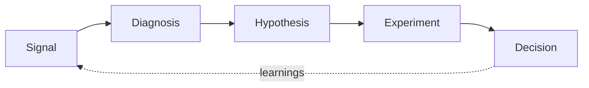

# Hi, I'm Zaneta 👋

### Growth Strategist · Experimentation · AI-Enabled Growth Systems

Growth strategist focused on experimentation, customer intelligence, behavioral analytics, and AI-enabled growth systems. Building tools that connect customer signals, funnel performance, and experimentation to measurable business outcomes.

I've spent my career in B2B SaaS and B2B training, owning CRO and experimentation programs across paid search, pay-per-lead, chat, webinar, and email channels. This GitHub is where I turn that operating experience into working software.

---

## 🧭 How I think about growth

---

## 🧠 Featured: [Growth Intelligence Operating System (GIOS)](https://github.com/Zaneta-lecounte/growth-intelligence-os) 🚧

A modular system that turns fragmented growth signals (customer research, behavioral analytics, funnel performance, and experiment results) into diagnosed problems, validated hypotheses, prioritized roadmaps, and reusable learning.

**Design principles:** deterministic math, evidence-linked AI claims, and scores that support judgment rather than replace it.

| Layer | Module | What it does |
|---|---|---|
| **Signal** | Customer Signal Synthesizer | Structures qualitative evidence into themes scored by frequency, severity, and commercial relevance |
| | Behavioral Friction Analyzer | Detects behavioral anomalies and classifies friction without claiming false causality |
| | Qualified Demand Leakage Auditor | Finds where qualified demand is lost between acquisition and revenue, and sizes the opportunity |
| **Diagnosis** | Growth Intelligence Diagnostic | Combines signal types into root-cause hypotheses, separating observed, inferred, and unknown |
| | Hypothesis Evidence Validator | Keeps assumption-led experiments off the roadmap with a 12-point evidence rubric |
| **Prioritization** | Experiment Opportunity Scorer | Ranks opportunities with the GROWTH framework, plus risk and sample-size flags |
| | Growth Priority Orchestrator | Builds a balanced Now / Next / Later roadmap across fixes, optimizations, bets, and research |
| **Learning** | Downstream Impact Analyzer | Tests whether wins hold through MQL, SQL, opportunity, and revenue, not just top-funnel CVR |
| | Experiment Learning Capture | Turns every result, including losses, into a searchable experiment library |
| | Growth Council Insight Brief | Converts signals into cross-functional decisions, owners, and a Slack-ready summary |

`Python` · `Streamlit` · `Pydantic` · `SciPy` · `Claude API` · `SQLite`

---

## 🧪 Also building

| Project | What it does | Stack | Status |
|---|---|---|---|
| [**Growth Experiment Lab**](https://github.com/Zaneta-lecounte/growth-experiment-lab) | Landing page with deterministic assignment, feature flags, exposure tracking, and a GA4-style dataLayer adapter | React · TypeScript · Vite · Vitest | 📋 Planned |

📋 Planned · 🚧 In progress · ✅ Live demo available

---

## 📈 What I bring from the field

- Built and run a multi-channel CRO and experimentation program end to end: hypothesis, test design, QA, analysis, rollout
- Implement analytics myself: GA4, GTM, dataLayer design, UTM attribution logic, form and marketing-automation integrations
- Build conversion-focused landing pages in HTML/CSS/JS and debug A/B testing platforms in production

---

## 🧰 Tech

**Analytics & experimentation**

**Engineering**

**AI**

---

## 🌱 Currently

- **Building:** GIOS, a growth intelligence and experimentation system using Python and Streamlit, plus experiment infrastructure in React and TypeScript, including funnel diagnostics, A/B test analysis, prioritization systems, and AI-assisted growth workflows
- **Learning:** React + TypeScript patterns for experiment infrastructure
- **Interested in:** Growth Engineering roles where experimentation, analytics, and product engineering overlap

---

## 📫 Connect

All project data is synthetic. No employer or client data is used in any repository.
