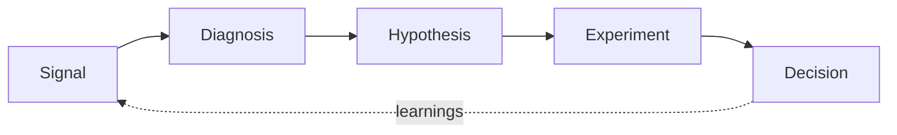

# Hi, I'm Zaneta 👋

### Growth Marketer → Growth Engineer

I identify growth problems using customer and behavioral intelligence, translate them into experiments, and build the systems required to test and scale the solutions.

I've spent my career in B2B SaaS and B2B training, owning CRO and experimentation programs across paid search, pay-per-lead, chat, webinar, and email channels. This GitHub is where I turn that operating experience into working software.

---

## 🧭 How I think about growth

Every project below is one piece of that loop, turned into a tool.

---

## 🛠️ Portfolio

| Project | What it does | Proves | Stack | Status |
|---|---|---|---|---|
| [**Growth Intelligence System**](https://github.com/Zaneta-lecounte/growth-intelligence-system) | Triangulates customer, behavioral, business, and experiment signals into ranked growth opportunities | Systems thinking, signal synthesis | Python · Streamlit · Pandas | 🚧 In progress |
| [**A/B Test Analyzer**](https://github.com/Zaneta-lecounte/ab-test-analyzer) | Significance, confidence intervals, and segment-level analysis for A/B tests | Statistics, experiment interpretation | Python · Streamlit · SciPy | 🚧 In progress |
| [**Funnel Friction Analyzer**](https://github.com/Zaneta-lecounte/funnel-friction-analyzer) | Finds funnel leakage and sizes each opportunity in downstream customers and revenue | Funnel analytics, opportunity sizing | Python · Streamlit · Plotly | 📋 Planned |
| [**CRO Experimentation Toolkit**](https://github.com/Zaneta-lecounte/cro-experimentation-toolkit) | Sample size, SRM checks, prioritization, hypothesis briefs, and retest decisions | Experimentation program design | Python · Streamlit | 🚧 In progress |
| [**Growth Experiment Lab**](https://github.com/Zaneta-lecounte/growth-experiment-lab) | Landing page with deterministic assignment, feature flags, exposure tracking, and a GA4-style dataLayer adapter | Front-end engineering, experiment infrastructure | React · TypeScript · Vite · Vitest | 📋 Planned |
| [**AI Growth Diagnostician**](https://github.com/Zaneta-lecounte/ai-growth-diagnostician) | Multi-step LLM agent that diagnoses conversion friction and designs a validated experiment | AI + growth methodology, evals | Python · Claude API · Pydantic | 📋 Planned |

📋 Planned · 🚧 In progress · ✅ Live demo available

---

## 📈 What I bring from the field

- Built and run a multi-channel CRO and experimentation program end to end: hypothesis, test design, QA, analysis, rollout
- Implement analytics myself: GA4, GTM, dataLayer design, UTM attribution logic, form and marketing-automation integrations
- Build conversion-focused landing pages in HTML/CSS/JS and debug A/B testing platforms in production

---

## 🧰 Tech

**Analytics & experimentation**

**Engineering**

**AI**

---

## 🌱 Currently

- **Building:** A Growth Intelligence System and Experimentation Toolkit that connect customer research, behavioral analytics, funnel performance, and statistical testing, built with Python, Streamlit, React, and TypeScript
- **Learning:** React + TypeScript patterns for experiment infrastructure
- **Interested in:** Growth Engineering roles where experimentation, analytics, and product engineering overlap

---

## 📫 Connect

All project data is synthetic. No employer or client data is used in any repository.
